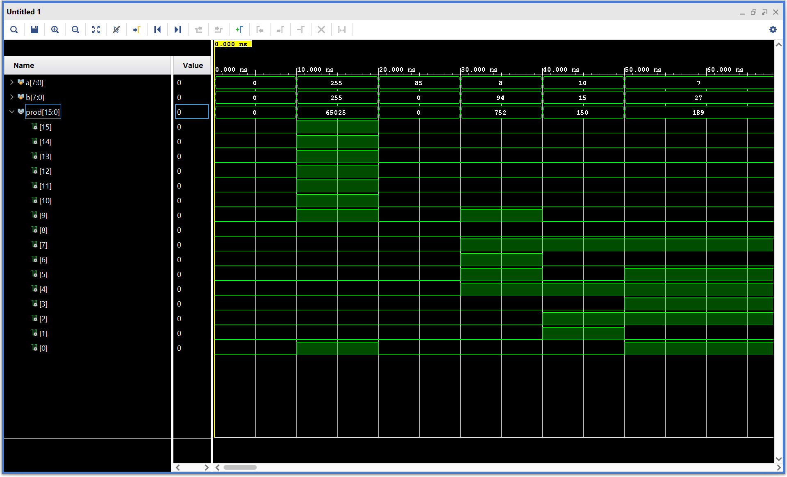

# Dadda vs. Sequential 8×8 Multiplier

Two implementations of the same 8×8 unsigned multiply, built to compare a fully
parallel design against a resource-shared one:

- **Dadda tree multiplier** (`Dadda8x8`): purely combinational, hand-built
  entirely from Verilog gate primitives.
- **Sequential shift-and-add multiplier** (`mult_seq_8x8`): one load cycle plus
  8 iteration cycles, one shared adder. Written afterward as a point of
  comparison, and modeled behaviorally rather than at gate level.

Simulated in Xilinx Vivado 2025.2.

---

## Result

| | Dadda tree | Sequential |
|---|---|---|
| Latency | Combinational, no clock | 1 load cycle + 8 iteration cycles |
| Modeling | Gate primitives only | Behavioral (`always @(posedge clock)`, `+`, shifts) |
| Adder hardware | 48 full adders + 8 half adders (56 one-bit cells) | One 16-bit adder |
| Other logic | 64 AND partial products, 1 buffer | 8-bit multiplier, 16-bit multiplicand and 16-bit product registers, 4-bit counter, busy flag |
| Control | None | Load/busy flag + counter |

Same function, same operand width, two different points on the area/latency
curve. The sequential version needs 3.5× fewer one-bit adder cells (16 vs. 56)
plus registers and a counter, at the cost of nine clock cycles per product. No
synthesis reports were captured for either design, so no LUT/FF numbers are
given here.

---

## Dadda tree multiplier

### Interface

| Signal | Dir | Width | Description |
|---|---|---|---|
| `a` | in | 8 | Unsigned operand, bit 0 is the LSB |
| `b` | in | 8 | Unsigned operand, bit 0 is the LSB |
| `prod` | out | 16 | Unsigned product, bit 0 is the LSB |

There is no clock; the module is purely combinational and gates are modeled
with zero delay.

### Structure

Every net is routed by hand at the gate level. The only Verilog constructs used
are `and`, `xor`, `or`, and `buf` primitives plus instantiations of the
gate-level `FA` and `HA` modules defined in the same file.

**Partial products.** 64 `and` primitives form the 8×8 partial-product matrix
(`ands[8*i + j] = a[i] & b[j]`).

**Reduction tree.** Four Dadda stages reduce the tallest column from 8 bits to
2, following the Dadda height sequence:

```
8 → 6 → 4 → 3 → 2
```

Each stage places only as many adders as needed to bring every column down to
the next target height, and uses a half adder wherever only two bits need
combining. Deferring compression this way is what distinguishes Dadda's method
from a Wallace tree, which compresses greedily at every stage and needs more
adders.

**Final addition.** The two remaining rows are summed by a ripple-carry chain:
`prod[0]` is the `a[0] & b[0]` partial product passed through a buffer,
`prod[1]` comes from a half adder, and `prod[2]` through `prod[14]` from 13 full
adders, with the last carry-out becoming `prod[15]`.

### Unit count

| Stage | Column height | Half adders | Full adders |
|---|---|---|---|
| 1 | 8 → 6 | 3 (`H1`–`H3`) | 3 (`F1`–`F3`) |
| 2 | 6 → 4 | 2 (`H4`–`H5`) | 12 (`F4`–`F15`) |
| 3 | 4 → 3 | 1 (`H6`) | 9 (`F16`–`F24`) |
| 4 | 3 → 2 | 1 (`H7`) | 11 (`F25`–`F35`) |
| Final ripple-carry adder | 2 → 1 | 1 (`H8`) | 13 (`F36`–`F48`) |
| **Total** | | **8** | **48** |

Plus 64 AND gates for the partial products and 1 buffer. Each full adder is
2 XOR + 2 AND + 1 OR and each half adder is 1 XOR + 1 AND, so the whole
multiplier is 321 primitive gates. Instance names in the RTL (`F1`–`F48`,
`H1`–`H8`) follow the hand-drawn dot diagram the tree was designed from.

---

## Sequential multiplier

### Interface

| Signal | Dir | Width | Description |
|---|---|---|---|
| `multiplier` | in | 8 | Unsigned multiplier |
| `multiplicand` | in | 8 | Unsigned multiplicand |
| `start` | in | 1 | Load operands and begin; sampled on the rising edge |
| `clock` | in | 1 | Free-running clock |
| `product` | out | 16 | Registered product, final 8 cycles after the load cycle |

### Operation

A shift-and-add engine reusing a single 16-bit adder:

1. On a rising edge with `start` high, the operands are loaded (multiplicand
   zero-extended to 16 bits), the product and a 4-bit counter are cleared, and
   a `busy` flag is set.
2. On each of the next 8 edges, the multiplicand is added into the product if
   the multiplier's current LSB is 1, then the multiplicand shifts left and the
   multiplier shifts right.
3. When the counter reaches 7 the `busy` flag clears and `product` holds the
   result.

`start` takes priority over `busy`, so asserting it mid-computation restarts the
multiply. There is no done/valid output; the consumer counts cycles or watches
the internal `busy` flag.

---

## Verification

Both designs were checked by inspecting simulation waveforms and `$display`
output in Vivado. Neither testbench is self-checking, and the two designs were
not run against each other.

**Dadda tree** (`tb/Dadda8x8_tb.v`), six directed vectors held for 10 ns each:

| `a` | `b` | `prod` | Purpose |
|---|---|---|---|
| 0 | 0 | 0 | Minimum |
| 255 | 255 | 65025 | Maximum, every partial product set |
| 85 | 0 | 0 | Multiply by zero |
| 8 | 94 | 752 | Even × even |
| 10 | 15 | 150 | Even × odd |
| 7 | 27 | 189 | Odd × odd |

All six products matched in the waveform:



Each vector is held for 10 ns, so the six cases occupy 0–60 ns. `prod` is shown
both as an unsigned value (0, 65025, 0, 752, 150, 189) and expanded bit by bit.
The 255 × 255 case sets every product bit except bits 1 through 8
(`1111111000000001`), and the multiply-by-zero case leaves every bit low. With
zero-delay gates the product changes in the same instant as the inputs.

**Sequential** (`tb/mult_seq_8x8_tb.v`), two vectors with a 10 ns clock:
170 × 255 = 43350 and 255 × 255 = 65025, each started with a one-cycle `start`
pulse and observed 100 ns later. No waveform capture was kept for this run.

Six vectors out of 65536 possible input pairs is not a proof of correctness. An
exhaustive testbench that sweeps all inputs and compares the two designs
against each other and against `*` would be the natural next step.

---

## Repository layout

```
rtl/Dadda8x8.v               Gate-level Dadda tree, with the FA and HA modules
rtl/mult_seq_8x8.v           Sequential shift-and-add multiplier
tb/Dadda8x8_tb.v             Directed testbench for the Dadda tree
tb/mult_seq_8x8_tb.v         Testbench for the sequential multiplier
docs/dadda8x8_waveform.png   Vivado waveform for the Dadda testbench
```

Both designs were run through the Vivado GUI; there are no scripts.

---

## Notes

The Dadda tree was Project 1 for ECE 310 (Spring 2026) at NC State University,
posted publicly with the instructor's permission. If you are currently enrolled
in this course, submitting this work as your own is an academic integrity
violation.
